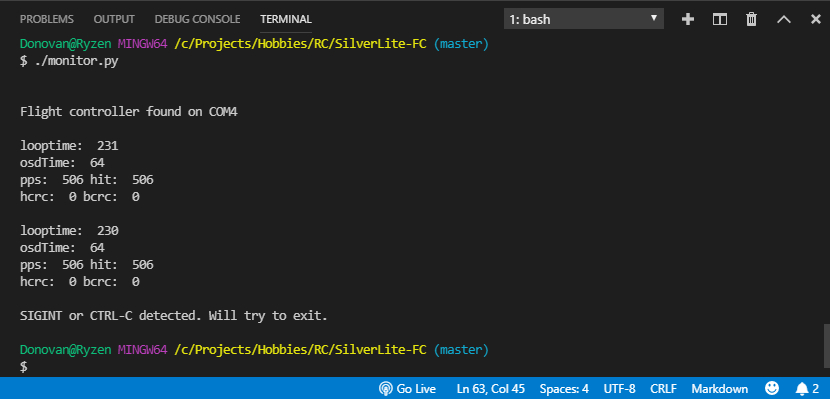

# Building

Before you can run this firmware onto your flight controller you will need to build it
and then flash it onto your board.

## The easy way to build and flash

Use Visual Studio Code as a lightweight development environment. Make sure you've setup the necesary development tools (see the [Development Tools Section](DevToolsSetup.md)).


Use the VSCode "Open Folder" option with the project folder you cloned from github. 

I've configured some files (within the `.vs` folder) to define some "tasks" that make it much easier to build and flash.

You can click on the "Run build task" icon in the status bar...


..or use the `Ctrl-Alt-T` keyboard combination to bring up the following menu which will let you clean, build and flash for any of the supported targets:


### Enter DFU mode

Before you can flash the firmware the flight controller board must enter DFU mode. Typically you would press a "BOOT" button on
the FC board (or jump some BOOT pads together) and then power up the flight controller board by plugging in the USB cable. You could
also power it up with a battery, but you'll still need to connect the board to your compute via USB.

If your board is currently running Betaflight and you can connect to it with the Betaflight configurator, you could instead use the "CLI"
option in Betaflight and enter `bl` in the command line to enter "bootloader" mode (DFU mode).

Once you've entered DFU mode you should be able to flash SilverLite onto your FC board.

### The `monitor.py` script
This is a handly little Python script I knocked out that listens over the virtual com port (the USB connection). SilverLite periodically
sends out a data packet every second that this script can decode and log onto the terminal window. 

However it can also be used to enter commands by pressing a key on your keyboard:

* `r` - This will reset the flight controller board and make it enter DFU mode
* `b` - This will instruct the onboard SPI receiver to enter BIND mode

This is a tool you probably won't need to use but I find it helpful when I'm developing (or debugging) a feature of SilverLite, it lets
me perform simple `printf()` style logging from the flight controller that I can see on my terminal window within VSCode.

To run the tool (be sure to have Python2 installed) and then run open a terminal window within VSCode and execute it.

Enter something like:
```
./monitor.py
```

Or maybe
```
python monitor.py
```

To quit the monitor script, you just need to enter `Ctrl-C` (maybe several times) and it will eventually terminate.

You can also leave it running and plug/unplug your FC board. The `monitor` script will poll the available serial ports on your computer
until it senses you've plugged the flight controller back in.





## A more in-depth description on how to build and flash manually

This project uses `make` to build and optionally flash the firmware. On Mac OS you may
(or may not) already have `make` installed. I had it on my Macs because I have
Xcode installed on them (along with the command line tools).

On my Windows 10 machine I had to install [MinGW-W64](https://sourceforge.net/projects/mingw-w64/) which installs
`mingw32-make.exe`; that is the name of the `make` tool that I use on Windows.

Whether on Mac or on Windows you'll want a terminal (or CMD prompt) window to run and execute
the `make` program.

I typically use a "Terminal" window within Visual Studio. You can set that up to use the 
Windows CMD.exe program but I prefer a `bash` command prompt. On my Windows PC I have git for
windows installed which also installs a `bash` shell. Both work fine. I enter the following
command in that terminal to build.

```
mingw32-make.exe -j12
```

Or on Mac or Linux you would type:
```
make -j12
```


> Note: The `-j12` instructs the `make` tool (`mingw32-make.exe`) to use twelve jobs (threads) when compiling; this speeds up the build process
substantially.

This will build the default `make` target named `all` (look towards the bottom of the `Makefile`).
If you examine the `Makefile` you'll see that it will build the `NOX` flight controller target
(due to the `TARGET` definition at the top of the file) and this will result in the following files being generated:

* `NOX.bin`
* `NOX.elf`
* `NOX.hex`

These will be found in the `gcc_release/NOX` folder. Any of these files can be used to flash the firmware
onto a flight controller board. Which one to use depends on the flashing tool/software you wish to use. 

The `Makefile` has several make targets that can be used to flash (or build then flash) the firmware
using different tools/software. More on that later.

## Specifying a Flight Controller Target
Because I did not specify a target with the earlier command line, the firmware will be built
for the (default) `NOX` flight controller target. See the [Targets](Targets.md) document for
details regarding the targets supported by SilverLite.

You can build the OMNIBUSF4 target by specifying it like so:

```
mingw32-make.exe -j12 TARGET=OMNIBUSF4
```

If you're developing code and make changes and would like to clean up all intermediate
object files (so you end up with a full rebuild) you can use the `clean` command like so:

```
mingw32-make.exe clean
```

> Note: When using `clean` make sure you specify the target if it isn't the default `NOX` target.

## Build and Flash

To flash the firmware onto a flight controller you will need to have it connected via USB
or via an ST-Link adapter.

The OMNIBUSF4 flight controller board (that I use) has breakout pads for the SWDIO and SWCLK pins
of the STM32. This lets me use an ST-Link adapter which gives me the added ability to debug
code in addition to flashing it.


If you examine the `Makefile` and look for the `flash` target you will see that it uses `openocd`
to flash the firmware when your build target is `OMNIBUSF4`. If your build target is `NOX`, the
makefile will instead use the command line version of [STM32CubeProgrammer](https://www.st.com/en/development-tools/stm32cubeprog.html)
to flash the firmware.

> Note: The `flash` target in the makefile will **build** and **flash**

Enter the following command line to flash (and build if necessary) the default `NOX` target:

```
mingw32-make.exe -j12 flash
```
Or

```
make -j12 flash
```

> Note: To flash the `OMNIBUSF4` target you must add `TARGET=OMNIBUSF4` to the command line

The NOX flight controller boards that I've been using (the "JMT Play F4" also known as "JHEMCU Play F4")
does not have the SWDIO and SWCLK pins exposed. This means I must reset the board into DFU (bootloader) mode
and connect it to my PC via USB. There are 2 boot pads on the top side near the front corner (look for "BOOT"
as shown in this pic):


Short those two boot pads together while powering up the board (either by connecting it to your PC
via USB or by connecting a battery to the board). I find this to be rather tricky to do so I've
added a feature to the firmware that lets you easily enter bootloader mode with a simple utility
program. So after the first successful flashing of the firmware you won't have to use those
boot pads again. More on this in the "Monitor" section of this document. 

Another method you can use to enter DFU mode is to use the "L-R-D" gesture (Left/Right/Down). But
this (of course) means you need to have successfully flashed the firmware once already and are able
to connect your TX to the flight controller.

> Note: If you have an OMNIBUSF4 target and don't wish to use an ST-Link adapter then edit the `Makefile`
so that it uses the [STM32CubeProgrammer](https://www.st.com/en/development-tools/stm32cubeprog.html)
to build and flash the firmware. My OMNIBUSF4 flight controller board actually has a handy pushbutton to enter
DFU mode. Alternatively you can build first (using the `all` target) and then use one of the flash targets described next.

## Flash only

Assuming you've built the firmware already you have your choice of two makefile targets

* `stlinkflash` - This will use OpenOCD to flash the firmware using an ST-Link adapter
* `download` - This will use STMCubeProgrammer to flash the firmware over USB


## Monitor

The `monitor.py` script (found in the project root folder) can be used to monitor the output of
the firmware via USB connection to your PC.

> Note: The `monitor.py` script requires you have the `PySerial` python module. Use `pip install PySerial` in case you don't already have it.

If you've successfully flashed the firmware you can use a simple utility program written in Python
to monitor the debug output of the firmware. Connect your board via USB to your PC. 

Invoke this script like so:

```
./monitor.py
```

Or like so:

```
python monitor.py
```

I usually open another "terminal" pane in Visual Studio for this. The output will look something like this:

```
Flight controller found on COM23

looptime:  81
osdTime:  43
pps:  0 hit:  0
hcrc:  0 bcrc:  0

looptime:  88
osdTime:  56
pps:  0 hit:  0
hcrc:  0 bcrc:  0

looptime:  83
osdTime:  43
pps:  0 hit:  0
hcrc:  0 bcrc:  0
```

The "looptime" stuff repeats like every second or so. The firmware has a few lines of code that emit log statements
that this `monitor.py` script can echo to your screen. These values were helpful to me when I was developing the
firmware. These will probably be removed but for now I'll document them here:

* "looptime" This is the time (in microseconds) for the longest loop within the past second. The firmware runs 4000 loop iterations per second.
* "osdtime" This is how long it took (in microseconds) to update the OSD. As you can see it is pretty expensive (I'm using a software SPI implementation)
* "pps" The number of packets *successfully* received and accepted per second. 
* "hit" The number of packets received but not necessarily accepted per second
* "hcrc" The number of packet CRC failures (as detected by hardware)
* "bcrc" The number of bayang packet Checksum failures (as detected by software)

> Note: If hardware CRC checking is available then Bayang checksum failures will never occur (as the hardware CRC check will reject the packet before
the Bayang checksum would occur)

Use `Ctrl-C` in the terminal window to kill the monitor program. If it doesn't close right away you may need to use `Ctrl-C` repeatedly until it
finally does. 

If you disconnect the flight controller the monitor program will continue to run and keep trying to re-connect to the flight controller. Plugging the controller back in will usually establish a reconnect with the monitor tool.

> Note: This `monitor.py` script might not work under Linux. I've used it on Windows 10 and Mac OS, however when trying to use it with Ubuntu running in Windows Subsystem for Linux 
it was not able to connect.

## Using the `monitor` to enter DFU (bootloader) mode
While the monitor tool is connected and running you can press your `r` key on your keyboard to reset the board into DFU mode. The terminal should
display the following when you do this:

```
Sending reset command
```

You will also see in the windows Device Manager tool that the Virtual COM port has disappeared and a new "STM32 BOOTLOADER" device appears
under the "Universal Serial Bus devices" section.

You can now flash new firmware to your board. Use the make tool and `flash` or `download` targets, or you can use the STM32CubeProgrammer
tool. 

