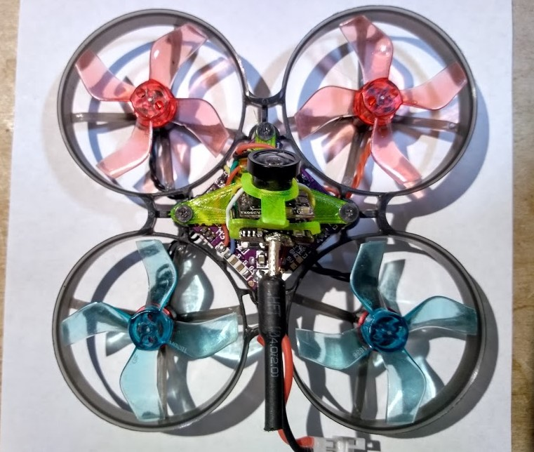
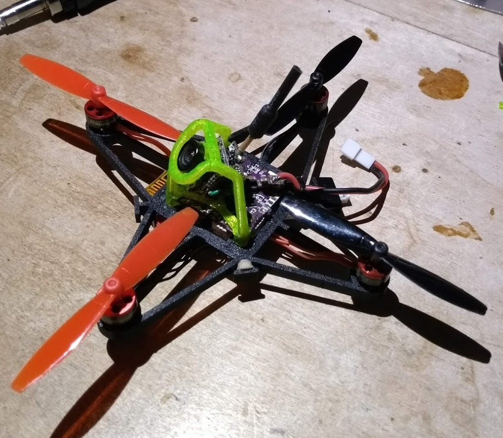
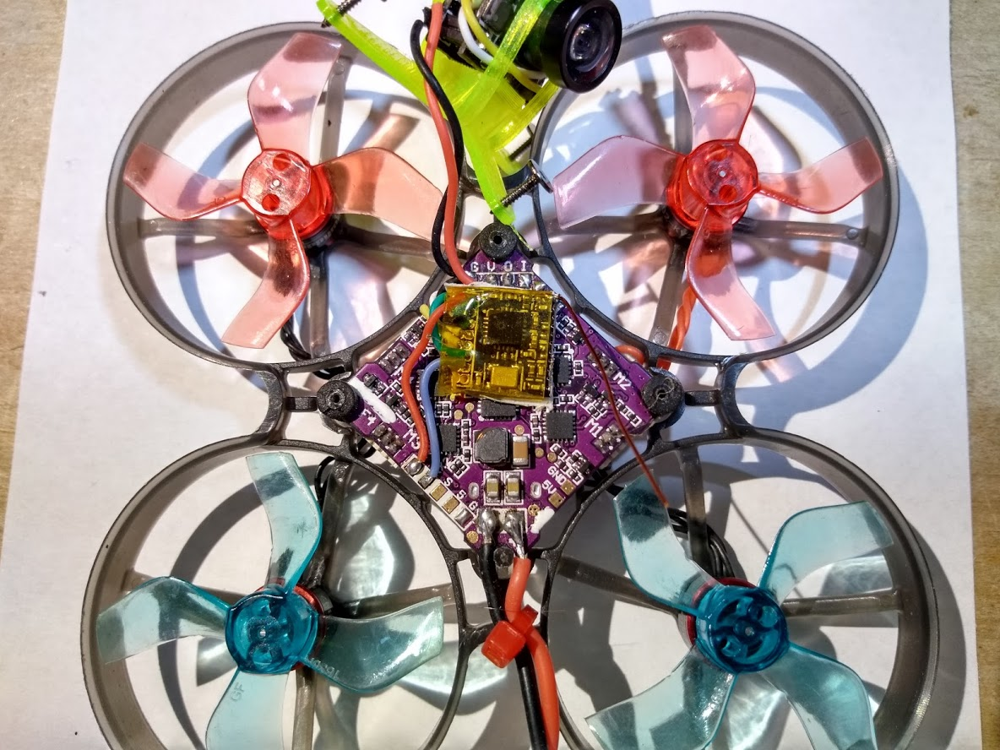
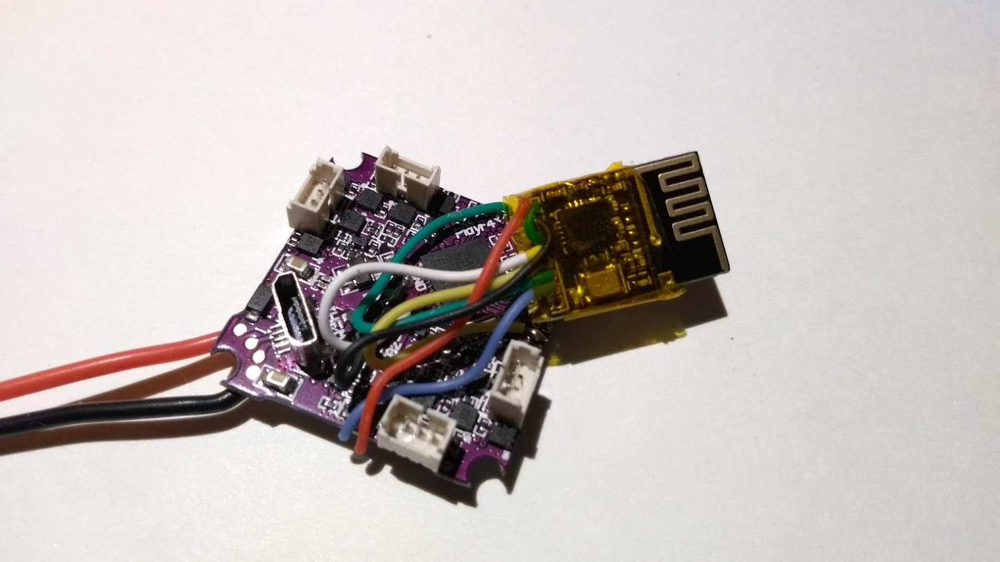

This describes how I use a "Play F4" whoop sized flight controller board with an NRF24L01 micro transceiver board.






The interface between the STM32 microcontroller and the NRF24L01 transceiver board is via software SPI. This consists
of the following control signals:

* MOSI (master out slave in)
* MISO (master in slave out)
* CS or CSN (chip Select NOT where active LOW signal means chip is selected)
* SCK (serial clock)

You can see why this is sometimes called 4-wire SPI. The XN297(L) sometimes comes in a 3-wire version where
MISO and MOSI are run on a single wire as the XN297 (slave) will never output at the same time that STM32 (master) is outputting.

In addition to the 4 signal wires we also need power (3.3 volts) and ground wire leads. That's a total of 6 wires
needed to interface the NRF24L01 to the Play F4 flight controller board.

## Top side of the Play F4 board


The 3.3v power and ground pads are readily available. The remaining pads that we can repurpose for our own use are:

* TX1 - Labeled T1 on the board. This is TX of USART1 (PB6)
* DSM/IBUS/PPM - Labeled RX2 on the board but please note that it really isn't an RX pin of a UART/USART (PB10)
* SBUS - This connects to a configurable logic inverter (enabled/disabled by PC14) before going to RX of USART2 (PA3)

## Bottom side of the board


* RX1       - Labeled R1 on the board. Goes directly to PB7 (verified with multimeter) (USART1 RX)
* TX2       - Labeled T2 on the board. Goes directly to PA2 (verified with multimeter) (USART2 TX)
* LED_STRIP - Labeled LED on the board. Goes directly to PA0 (verified with multimeter)
* BZ-       - Labeled BZ- on the board. Does not seem to be directly tied to STM32, probably uses a driver transistor to PC13

All of the pads that are directly tied to the STM32 processor can be used to connect the NRF24L01. This is because
the input/output pins of the STM32 are easily configurable. 

Let me re-list the port pins we can use:

* `PA0`     LED_STRIP
* `PA2`     TX2
* `PB6`     TX1
* `PB7`     RX1
* `PB10`    DSM/IBUS/PPM

Most any pin of the STM32 can be configured for either input or output. This makes it easy for us
to use any of those pads for any SPI signal. The header file `trx_spi_config.h` is
where you perform this configuration. Here is a copy/paste of the default configuration I use:

```
static Pin<'A', 2>		TRX_CS_PIN;	    // PA2		TX2
static Pin<'A', 0>		SPI_SCK;	    // PA0		LED_STRIP
static Pin<'B', 6>		SPI_MOSI;	    // PB6		TX1
static Pin<'B', 10>		SPI_MISO;	    // PB10		DSM/IBUS/PPM
```

Here you can see pin `PA2` is assigned to the `CS` signal, `PA0` is assigned to `SCK` signal, and so on.
This is the wiring method that works for me when I mount the NRF24L01 micro board on top front side of the flight controller board.



Only two of the wires have to reach around to the bottom side, and those FC pads are actually very close to the corresponding NRF24L01 pads
since I oriented the NRF24L01 to have its pads to the left (as shown in the pic).

> Note: You'll notice that I removed the onboard PCB antenna (I simply snapped it off) and replaced it with a length of enamel wire.

Below is a different orientation where I had the transceiver module on the bottom side of the flight controller board (as used on the
black micro shown at the top of this page):



> Note: Here you can see I'm using the built-in PCB antenna. If you look at the black GR1FF Race micro at the top of this page you'll also be able to see the antenna

I chose to use the `RX1` pad on the bottom side for `CS`

```
static Pin<'B', 7>		TRX_CS_PIN;	    // PB7 		RX1
static Pin<'A', 0>		SPI_SCK;	    // PA0		LED_STRIP
static Pin<'B', 6>		SPI_MOSI;	    // PB6		TX1
static Pin<'B', 10>		SPI_MISO;	    // PB10		DSM/IBUS/PPM
```

### Defining the pins
As you've probably noticed, the `Pin<>` template takes an uppercase character (like 'A', 'B', etc) to specify which STM32 port the pin is on
and the second parameter is the pin number. It's that simple. No need to use [STM32CubeMX](https://www.st.com/en/development-tools/stm32cubemx.html),
just edit `SilverLite\trx_spi_config.h`.


## Don't do the following!


Please be very careful with how you wire the board. The above picture shows an orientation (where the NRF24L01 was rotated 90degrees
so that the module's pins were facing towards the bottom corner). You'll see that several wires are very close to
the black squarish component which is an inductor (with 100 printed on it). This led to a significant amount of electrical/rf noise traveling to the module
and pretty much prevented any reception!

