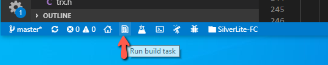
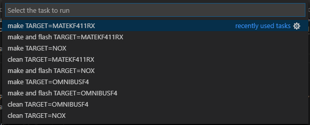

# Flight Controller Targets

This codebase currently supports several *targets* using the STM32F411 or STM32405 processors. A *target* is simply the name of a hardware configuration (processor and peripherals) that was defined for use with Betaflight. Different flight controller boards can be made that correspond to a given target.

The target names I'm using come straight from Betaflight. By examining various source files in Betaflight I'm able to reverse engineer what peripherals are used on the flight controller boards and also what pins are used.

The following flight controller targets are currently defined:

* `OMNIBUSF4` 	- This uses the STM32F405 processor which runs at 168Mhz
* `NOX`         - This uses the STM32F411 processor which runs at 98Mhz or 100Mhz (we must use 98Mhz for proper USB Virtual Com Port support)
* `MATEKF411RX` - This uses the STM32F411 processor. At this time only the "HappyModel Crazybee F4 Lite 1S FlySky" flight controller is currently supported.

I had also planned on supporting the CrazyBee F3 flight controller but have yet to do so.


Note: The `Makefile` defaults to building for the `NOX` target but this can be overriden when invoking the makefile by specifying the `TARGET` on the command line like so:

```
mingw32-make.exe -j12 flash TARGET=OMNIBUSF4
```

The above command will build the `OMNIBUSF4` target and flash the build onto the flight controller board.
For more details on how to build and flash (and develop) this software read the [Develop](Develop.md) page

If using Visual Studio Code then you can click on the "Run build task" icon in the status bar...


..or use the `Ctrl-Alt-T` combination to bring up this menu which will let you clean, build and flash for any of the supported targets:




## `MATEKF411RX`

The "HappyModel Crazybee F4 Lite 1S FlySky" flight controller is a `MATEKF411RX` target board. This board is used on the Mobula 6.

This flight controller (and target) also supports an FrSky SPI receiver as well. However I only possess the FlySky version and therefore only built support for the AFHDS/AFHDS2A receiver.


This is the easiest board to use with SilverLite-FC. 


## `NOX`

I've been using the "Play F4" flight controller (sometimes described as "JHEMCU Play F4" or "JMT Play F4"). This board is a NOX target. This is what it looks like:


By examining the Betaflight source code and `target.h` files for this Betaflight target (as well as using the `resource` and `resource list` commands) we can learn
how the STM32 processor interfaces with the MPU, OSD and other peripherals.

For example, the following pads of the Play F4 board map to the STM32 pins:
 
 On top side of board are:

* 3.3v
* DSM/IBUS/PPM  - Goes directly to PB10 (verified with multimeter)
* SBUS      - Coupled thru a switchable inverter (controlled by PC14) and then (I think) to PA3 (USART2 RX)
* 5v
* GND
* TX1       - Goes directly to PB6 (USART1 TX)

On back (bottom) side of board are:

* RX1       - Goes directly to PB7 (verified with multimeter) (USART1 RX)
* TX2       - Goes directly to PA2 (verified with multimeter) (USART2 TX)
* LED_STRIP - Goes directly to PA0 (verified with multimeter)
* BZ-       - Does not seem to be directly tied to STM32, probably uses a driver transistor to PC13

This information is important if you want to change which pads to use to interface
to your transceiver board (NRF24L01, XN297, XN297L or LT8900). More information can be found
in the [Transceiver Modules](Transceiver.md) section.

## Adding support for new targets

This section will contain my notes on what is required to add support for new targets. The notes are largely based on what I performed for adding the `MATEKF411RX` target.

The project folder structure contains a `Targets` folder that in turn contains subfolders for each of the targets (such as `NOX`, `OMNIBUSF4`). In turn these folders contain the following:

* `TARGET_NAME.ioc` - This is an STM32CubeMX project file used to configure the STM32 and its peripherals.. The `TARGET_NAME` will be something like `NOX` or `OMNIBUS`, etc.
* Core - STM32CubeMX generated source files

I want to add support for the Mobula6 flight controller which is the "HappyModel Crazybee F4 Lite 1S" board.
In Betaflight it is known as the `MATEKF411RX` target. So I would create a new folder with that name within
our `Targets` folder. 

Using STM32CubeMX you'll want to configure the various pins and perhipherals of the STM32 chip:

* Under "Project Manager":
    * "Project" -> "Application Structure" - "Advanced"
    * "Code Generator" 
        * "Toolchain / IDE" - "MDK-ARM"
        * "Min Version" - "V5"
* Set clock config as appropriate (making sure you choose options that allow VCP to work correctly)
    * Set "HCLK" to desired clock frequency (72, 96, 100, 120, etc)
        * This will adjust sources (Use HSE instead of HSI, etc)
* Configure TIM2. It is used for `gettime()`
    * "Clock Source" - "Internal Clock"
    * "Counter Settings"
        * "Prescaler" - Set to match clock Mhz
        * "Counter Period" - 0xFFFFFFFF
* Configure ADC1. It is used for monitoring battery voltage
    * To configure ADC, look within Betaflight `target.h` for VBAT_ADC_PIN and then in "Pinout view"
    select that pin and configure it for ADC. 
        * For F3 this results in enabling ADC1_IN1
            * Then in "ADC1 Mode and Configuration" for "IN1" choose "IN1 Single-ended".
                Also tick the "Vrefint Channel" checkbox.
            * Under "Parameter Settings"
                * Under "ADC_Settings"
                    * "Clock Prescaler"
                        * For F4 - "PCLK2 divided by 8"
                        * For F3 - "Synchronous clock mode divided by 4"
                    * "Resolution" - "ADC 12-bit resolution" (this should already be set)
                    * "Scan Conversion Mode" - "Enabled". NOTE: This won't be selectable yet, we'll do it later
                    * "Continuous Conversion mode" - "Enabled"
                    * "DMA Continuous Requests" - "Enabled"
                * Under "ADC_Regular_ConversionMode"
                    * F3 - "Enable Regular Convresions" - "Enable". NOTE: This should already be setup
                    * "Number of Conversion" - "2". NOTE: *THIS* will change "Scan Conversion Mode" from "Disabled" to "Enabled"
                    * Expand Rank 1 and..
                        * Ensure "Channel" is set to "Channel 1"
                        * "Sampling Time" - "181.5 Cycles"
                    * Expand Rank 2 and..
                        * Ensure "Channel" is set to "Channel Vrefint"
                        * "Sampling Time" - "181.5 Cycles"
            * Under "DMA Settings" click "Add" and then for: DMA Request, Channel, Direction, Priority
                * ADC1, DMA1 Channel 1, Peripheral To Memory Low
                * Under "DMA Request Settings" for this new entry:
                    * "Mode" - "Circular"
                    * "Increment Address" - Tick only the "Memory" checkbox
                    * "Data Width" - "Peripheral"->"Word", "Memory"->"Word"
* Configure LED pin (check Betaflight/target.h file)
    * Configure for GPIO_Output: "GPIO mode" to "Output Push Pull", "Maximum Output Speed" to "High"
    * Label it "LED" so that "LED_Pin" is generated since it is used by code
* For F3 targets (only), configure USB
    * Under "Pinout & COnfiguration, chooose "Connectivity" then select "USB"
        * Under "USB Mode and Configuration"->"Mode" tick the "Device (FS)" checkbox
    * Under "Middleware" select "USB_DEVICE"
        * Set "Class for FS IP" to "Communication Device Class (Virtual Port Com)"


* TIM1 and DMA are used for implementing DSHOT.
    * Configure TIM1
        * "Clock Source" - "Internal Clock"
        * "Channel1" - "Output Compare No Output"
        * "Channel2" - "Output Compare No Output"
        * Under "DMA Settings" click on "Add" and create the following
            * For F4 devices (DMA Request, Stream, Direction, Priority):
                * TIM1_UP,  DMA2 Stream 5,  Memory To Peripheral,   High
                * TIM1_CH1, DMA2 Stream 1,  Memory To Peripheral,   High
                * TIM1_CH2, DMA2 Stream 2,  Memory To Peripheral,   High
            * For F3 devices (DMA Request, Channel, Direction, Priority)
                * TIM1_UP,  DMA1 Channel 5,  Memory To Peripheral,   High
                * TIM1_CH1, DMA1 Channel 2,  Memory To Peripheral,   High
                * TIM1_CH2, DMA1 Channel 3,  Memory To Peripheral,   High
            * Ensure each addition (under "DMA Request Settings") configures:
                * "Mode" is "Normal"
                * "Data Width" to be "Word"/"Word"
                * "Increment Address" is ticked for "Memory" *EXCEPT* for "TIM1_UP"
            * The "NVIC Settings" for all of the DMA interrupts should show they are enabled


CRAZYBEEF3FS 
```
# resource show
IO
A00: ADC_BATT
A01: ADC_CURR
A02: MOTOR 4
A03: MOTOR 3
A04: GYRO_CS 1
A05: SPI_SCK 1
A06: SPI_MISO 1
A07: SPI_MOSI 1
A08: RX_SPI_EXTI
A09: RX_SPI_BIND
A10: LED
A11: USB
A12: USB
A13: FREE
A14: FREE
A15: FREE
B00: FREE
B01: OSD_CS
B02: FREE
B03: LED 1
B04: FREE
B05: FREE
B06: FREE
B07: FREE
B08: MOTOR 1
B09: MOTOR 2
B10: FREE
B11: FREE
B12: RX_SPI_CS
B13: SPI_SCK 2
B14: SPI_MISO 2
B15: SPI_MOSI 2
C13: GYRO_EXTI
C14: FREE
C15: BEEPER
F00: FREE
F01: FREE
F04: FREE

# resource
resource BEEPER 1 C15
resource MOTOR 1 B08
resource MOTOR 2 B09
resource MOTOR 3 A03
resource MOTOR 4 A02
resource MOTOR 5 B06
resource LED_STRIP 1 B04
resource SERIAL_TX 3 B10
resource SERIAL_RX 3 B11
resource LED 1 B03
resource SPI_SCK 1 A05
resource SPI_SCK 2 B13
resource SPI_MISO 1 A06
resource SPI_MISO 2 B14
resource SPI_MOSI 1 A07
resource SPI_MOSI 2 B15
resource ADC_BATT 1 A00
resource ADC_CURR 1 A01
resource OSD_CS 1 B01
resource RX_SPI_CS 1 B12
resource RX_SPI_EXTI 1 A08
resource RX_SPI_BIND 1 A09
resource RX_SPI_LED 1 A10
resource GYRO_EXTI 1 C13
resource GYRO_CS 1 A04
```


Required by Silverware:

* SPI interface for the MPU (4-wire soft spi implementation)
    * SPI_MPU_SS - PA4 (GPIO output)
    * SPI2_CLK  - PA5 (GPIO output)
    * SPI2_MISO - PA6 (GPIO input)
    * SPI2_MOSI - PA7 (GPIO output)
* SPI interface for the OSD
    * This is actually configured by editing `drv_osd_spi.config.h` rather than via Stm32CubeMX
* SWD pins (SWDIO, SWCLK) - If available
    * SWD is not available on `MATEKF411RX`, in fact PA14 and/or PA13 are used for other purposes
* ESC1 - PB10 (GPIO output)
* ESC2 - PB6 (GPIO output)
* ESC3 - PB7 (GPIO output)
* ESC4 - PB8 (GPIO output)

* VOLTAGE_DIVIDER - PB0 (ADC input)
* LED - PC13 (GPIO output)

Additional/Available on this FC board

* CURRENT_METER_ADC_PIN - PB1 (ADC)


RX SPI (FlySky A7105)
* SPI3_SCK_PIN  - PB3 (GPIO output)
* SPI3_MISO_PIN - PB4 (GPIO input)
* SPI3_MOSI_PIN - PB5 (GPIO output)
* RX_NSS_PIN    - PA15 (GPIO output)
* RX_SPI_EXTI_PIN - PA14 (GPIO External interrupt mode)
    * Examining `A7105Init()` in Betaflight source code reveals it is configured for `EXTI_TRIGGER_RISING`
* RX_SPI_LED_PIN - PB9 (GPIO output)
* RX_SPI_BIND_PIN - PB2 (GPIO input), Should we enable pull up or pull down? After completing support for this target I discovered it did not need any pull up or pull down.

Note: For ESC pinouts look inside Betaflight for the corresponding `target.c` and you'll see a table like this:
```
const timerHardware_t timerHardware[USABLE_TIMER_CHANNEL_COUNT] = {
    DEF_TIM(TIM9, CH2, PA3,  TIM_USE_PPM,   0, 0), // PPM/RX2

    DEF_TIM(TIM2, CH3, PB10, TIM_USE_MOTOR, 0, 0), // S1_OUT - DMA1_ST1
    DEF_TIM(TIM4, CH1, PB6,  TIM_USE_MOTOR, 0, 0), // S2_OUT - DMA1_ST0
    DEF_TIM(TIM4, CH2, PB7,  TIM_USE_MOTOR, 0, 0), // S3_OUT - DMA1_ST3
    DEF_TIM(TIM4, CH3, PB8,  TIM_USE_MOTOR, 0, 0), // S4_OUT - DMA1_ST7

    DEF_TIM(TIM5, CH1, PA0,  TIM_USE_LED,   0, 0), // 2812LED - DMA1_ST2

    DEF_TIM(TIM9, CH1, PA2,  TIM_USE_PWM,   0, 0 ), // TX2
    DEF_TIM(TIM1, CH2, PA9,  TIM_USE_PWM,   0, 0 ), // TX1
    DEF_TIM(TIM1, CH3, PA10, TIM_USE_PWM,   0, 0 ), // RX1
};
```

This describes the timer peripherals used on the STM32 and you'll notice that
4 entries are tagged with `TIM_USE_MOTOR`; these are the ESC pins in order
from ESC1 thru ESC4.

To debug/diagnose proper motor order here's a helpful post on Markus' SilF4ware blog:
https://www.rcgroups.com/forums/showpost.php?p=41995581&postcount=341


## STM32 resources

These are just some notes on various STM32 resources used by the firmware.

* SystemClock
* ADC1 - Battery voltage
* TIM1 and DMA2 are used for implementing DSHOT.
    * TIM1_UP:    DMA2, Stream 5, NVIC global interrupt enabled
    * TIM1_CH:    DMA2, Stream 1, NVIC global interrupt enabled
    * TIM1_CH2:   DMA2, Stream 2, NVIC global interrupt enabled
* TIM2 for gettime()

If blackbox is enabled (default is disabled) the following are used:

* NOX:
    * USART2_TX, 2MB, 8N1
        * DMA1, Stream 6
* OMNIBUSF4
    * UART4_TX, 2MB, 8N1
        * DMA1, Stream 4
